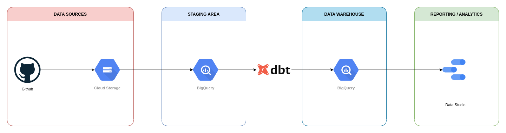
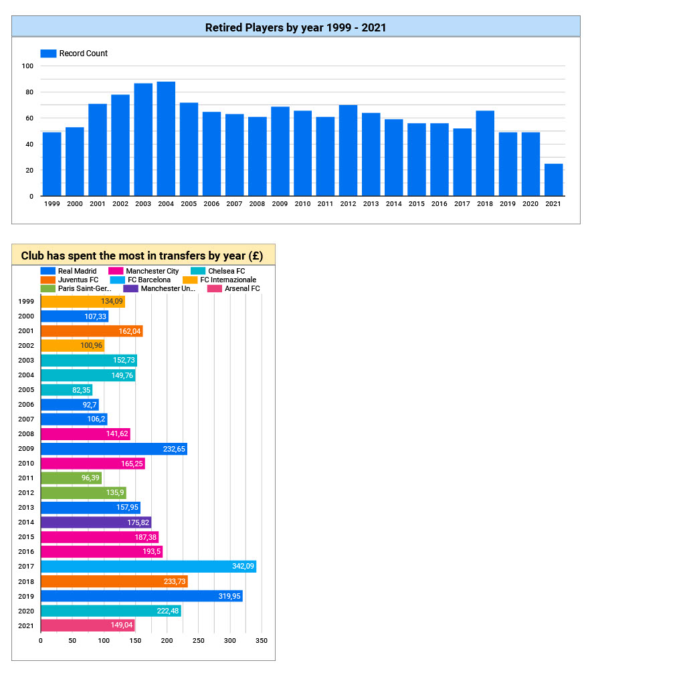

# Football Data Analytics

Final project data enginerring zoomcamp: https://github.com/DataTalksClub/data-engineering-zoomcamp

## Objective
Process files with football transfers data between 1999 and 2021 to get analytics of players transfers in the main European football leagues.

## Sources
The origial repository with csv files: https://github.com/ewenme/transfers 

## Prerequisites
- Installed locally:
    - Terraform (v1.1.7)
    - Python 3
    - Docker with docker-compose
- A project in Google Cloud Platform

## Setup
1. From IAM in GCP (https://console.cloud.google.com/iam-admin/serviceaccounts) create a new service account, add a key associated to this account and download the credentials file, rename it to "google_credentials.json" and save the file in the root.
2. Create a credentials folder in the root and paste inside your file "google_credentials.json".
2. Run `cp terraform.tfvars.example terraform.tfvars` 
2. Run `terraform init`
3. Run `terraform plan` to check which resources will be created/updated in GCP.
4. Run `terraform apply` to create or udpate resources.

## Architecture diagram

## Technologies
* Terraform
* Google Cloud Platform (GCP): Cloud-based auto-scaling platform by Google
    * Google Cloud Storage (GCS): Data Lake
    * BigQuery: Data Warehouse
    * Data Studio: Analytics Visualization
* Docker: Containerization
* SQL: Data Analysis & Exploration
* Prefect: Pipeline Orchestration
* dbt: Data Transformation

# Data Studio Link
https://datastudio.google.com/reporting/db73251e-5763-4cb7-a407-9f2ebc8d148a

